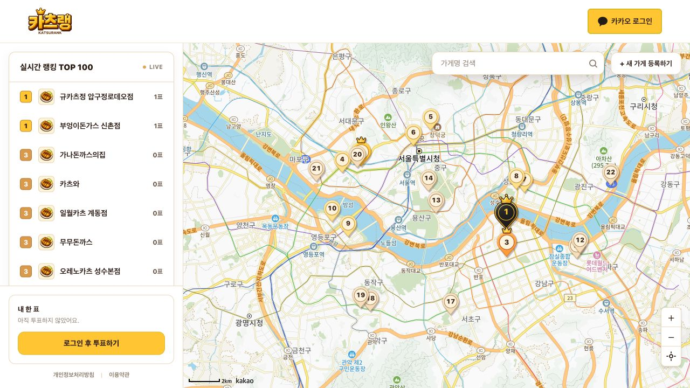
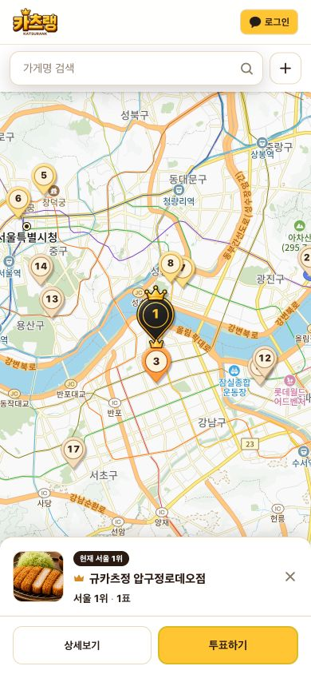
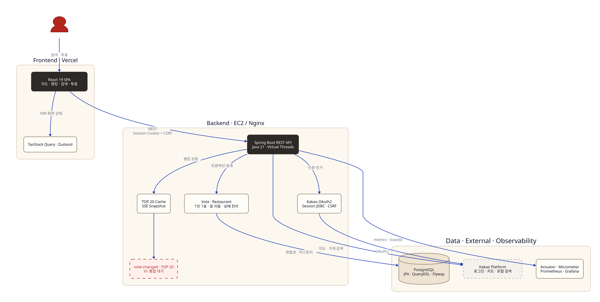
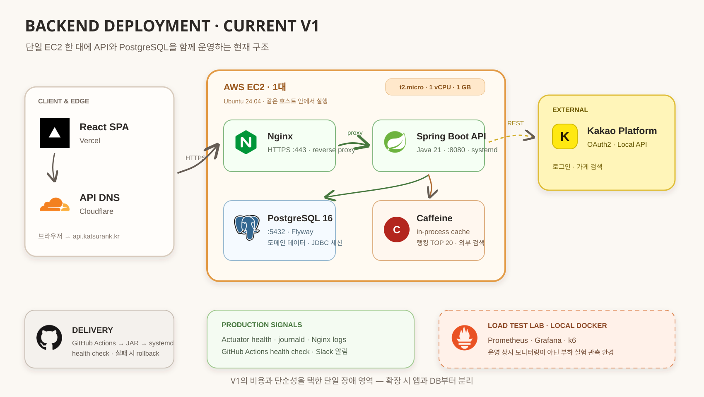

# 카츠랭 Katsurank

> **당신의 인생 돈까스 한 집.**
> 별점 대신 한 사람이 평생 한 장만 행사하는 표로 서울 최고의 돈까스집을 가리는 서비스입니다.

사용자는 카카오로 로그인해 가장 좋아하는 한 가게에 투표하고, 더 맛있는 집을 찾으면 표를 옮깁니다.
지도에서 가게를 찾아보되, 랭킹은 지도를 움직여도 달라지지 않는 **서울 전체 단 하나의 순위**입니다.
별점과 리뷰를 쌓기보다 “이 집이 내 1순위다”라는 선택을 모으는 서비스입니다.

[서비스 화면 보기](https://www.katsurank.kr) · [현재 개발 상태](docs/09_current_status.md) ·
[기술적 의사결정](docs/10_technical_decisions.md) ·
[성능 개선 이야기](backend/loadtest/PERFORMANCE_STORY.md)

## 핵심 문제와 해결 방식

개인 프로젝트로 제품 규칙을 정하고, 데이터 모델과 API, 화면, 배포 환경을 구현했습니다.
“한 사람의 표는 한 장이어야 한다”, “표를 옮겨도 기록은 남아야 한다”는 규칙을 지키기 위해 다음 문제를 다뤘습니다.

| 문제 | 직접 설계·구현한 해결 방식 |
|---|---|
| 동시 요청에서도 한 사람의 표는 한 장이어야 한다 | 부분 유니크 인덱스, 낙관적 락, 새 트랜잭션 재시도로 정합성 보장 |
| SPA 인증을 서버가 통제할 수 있어야 한다 | 카카오 OAuth2, Spring Session JDBC, CSRF Double Submit Cookie 구성 |
| 폐업·이전·표 이동 뒤에도 기록이 남아야 한다 | hard delete 대신 상태 전이와 투표 히스토리로 데이터 lifecycle 설계 |
| 반복 polling이 DB와 서버를 압박한다 | k6·Prometheus로 병목 측정 후 지터 → 캐시 → SSE 순으로 개선 |
| 실제 사용 가능한 서비스까지 전달해야 한다 | React 지도 UI, Spring REST API, EC2·Nginx·Vercel·GitHub Actions 운영 구성 |

## 서비스 화면

현재 배포된 서비스의 실제 화면입니다. 데스크톱은 랭킹과 지도를 함께 보고, 모바일은 지도 탐색에
집중한 뒤 선택한 가게를 하단 카드로 확인합니다.

> 아래 이미지는 2026-09-01에 확인한 메인 화면입니다. 최신 랭킹 SSE 백엔드는 아직 이 배포본과
> 통합 전이며, 상세 화면의 데모성 정보는 V1 공개 전 제거할 항목으로 추적하고 있습니다.



<p align="center">
  
</p>

## 서비스의 핵심 규칙

| 규칙 | 제품에 반영한 방식 |
|---|---|
| 1인 1표 | 사용자별 현재 유효표를 DB 부분 유니크 인덱스로 최종 보장 |
| 표 이동 | 이전 표는 삭제하지 않고 비활성화해 히스토리로 보존 |
| 서울 단일 랭킹 | 지도 범위와 무관하게 서울 전체 순위를 하나만 제공 |
| 폐업은 박제 | 표와 기록은 보존하되 랭킹과 신규 투표에서 제외 |
| 이전은 승계 | 새 가게 레코드로 기존 표를 옮기고 연결 관계를 보존 |
| 지점은 독립 가게 | 카카오 place ID를 기준으로 지점별 경쟁을 유지 |

## 현재 구현된 화면과 API

- 카카오 OAuth2 로그인과 세션 기반 인증
- 지도·랭킹·검색·내 표를 한 화면에 통합한 반응형 SPA
- 카카오맵 핀과 순위 구간별 시각적 강조
- 가게 상세와 딥링크 공유, 현재 표와 투표 히스토리
- 카카오 로컬 검색을 이용한 서울 돈까스집 등록
- 1인 1표 투표 및 다른 가게로 표 이동
- 백엔드의 가게 폐업·이전 처리와 기록 보존
- 개인정보처리방침과 이용약관

랭킹 TOP 20 캐시와 SSE 스냅샷 전파 백엔드는 통합 준비 브랜치에 있습니다. 위 공개 화면과 통합된 기능으로 보지 않으며, 남은 차이는 [현재 개발 상태](docs/09_current_status.md)에서 확인할 수 있습니다.

## 서비스 흐름



가게 탐색부터 투표와 랭킹 반영까지의 흐름입니다. 배포 구성은 다음 구조도에서 설명하며,
이 그림의 편집 원본은 [Excalidraw 파일](docs/architecture/katsurank-v1.excalidraw)로 관리합니다.

## 현재 백엔드 배포 구조



운영은 EC2 한 대에 Nginx, Spring Boot, PostgreSQL을 함께 둔 단일 인스턴스 구조입니다.
Prometheus·Grafana는 현재 운영 상시 모니터링이 아니라 로컬 부하 실험 관측 환경이며, 운영 신호는
Actuator 헬스체크, journald·Nginx 로그, GitHub Actions 헬스체크와 Slack 알림으로 확인합니다.
구조도 원본은 [Eraser diagram-as-code 파일](docs/architecture/katsurank-backend.eraserdiagram)입니다.

백엔드는 Controller → Service → Repository의 3계층을 유지합니다. 작은 팀과 단일 서비스에서
헥사고날 아키텍처의 추가 간접 계층보다 예측 가능한 코드 위치와 빠른 변경을 우선했고, 비즈니스 규칙은
`Vote`, `Restaurant` 같은 도메인 모델과 서비스 트랜잭션 경계에 배치했습니다.

## 기술 스택

| 영역 | 기술 |
|---|---|
| Frontend | React 19 · TypeScript 6 · Vite 8 · React Router 7 |
| 상태 관리 | TanStack Query 5 · Zustand 5 |
| UI | Tailwind CSS 4 · Kakao Maps JavaScript SDK |
| Backend | Java 21 · Spring Boot 4 · Spring MVC · Virtual Threads |
| Data | JPA/Hibernate · QueryDSL · PostgreSQL · Flyway · Caffeine |
| Security | Spring Security · Kakao OAuth2 · Spring Session JDBC · CSRF Double Submit Cookie |
| Observability | Actuator · Micrometer · Prometheus · Grafana · 구조화 로그 · traceId |
| Delivery | AWS EC2 · Nginx · systemd · GitHub Actions · Vercel |
| Verification | JUnit 5 · Spring 통합 테스트 · ArchUnit · k6 |

## 주요 설계 결정

### 1. DB 제약과 동시성 제어로 보장하는 1인 1표

동시에 두 요청이 들어와도 한 사용자에게 현재 표가 두 장 생기지 않아야 합니다.

- `(user_id) WHERE is_current = true` 부분 유니크 인덱스로 DB 최종 보장
- `Restaurant.vote_count`에 낙관적 락을 적용해 lost update 방지
- 충돌 시 매번 새 트랜잭션으로 제한 재시도
- 표 이동 시 기존 표를 먼저 비활성화·flush한 후 새 표 생성

### 2. 외부 저장소 기반 세션 관리

SPA라는 이유만으로 JWT를 선택하지 않았습니다. 단일 백엔드에서는 JWT의 무상태성보다 로그아웃과
서버 측 세션 무효화 가능성이 중요하다고 판단했습니다. 현재 구현 범위는 사용자 로그아웃과 해당 세션
종료이며, 운영자 계정 차단·전체 세션 일괄 무효화는 별도 관리 기능이 필요합니다. 세션은
`spring-session-jdbc`로 PostgreSQL에 저장하고 쿠키 인증에 맞춰 CSRF를 처음부터 활성화했습니다.

### 3. 상태 변경과 이력 보존

“표는 누군가의 진심”이라는 제품 규칙을 데이터 모델까지 이어 갔습니다. 폐업한 가게와 이전 표를
hard delete하지 않고 상태와 연결 관계로 보존합니다. 그 결과 쿼리마다 활성 상태를 명확히 구분해야 하는
복잡성을 감수했습니다.

### 4. 부하 측정에 따른 랭킹 갱신 개선

1,000명이 1~2초마다 같은 랭킹을 polling하면 DB 연결 대기와 꼬리 지연이 급증했습니다. 시작 시각을
흩는 지터와 TOP 20 캐시를 차례로 시험했고, 캐시 적중 요청에도 트랜잭션 때문에 DB 연결 비용이 남는
문제까지 확인했습니다. 이후 캐시 hit 경로를 트랜잭션 밖으로 분리하고 SSE 스냅샷 전파를 구현했습니다.

| 역사적 로컬 실험 | 관측 결과 |
|---|---:|
| 1,000명 · 2초 polling | 약 375 RPS, 응답 p95 약 2.56초, DB 연결 대기 최대 951 |
| 1,000명 · 1초 polling | 약 357 RPS, 응답 p95 약 3.98초, DB 연결 대기 최대 981 |
| REST 처리량 탐색 | 약 2천 RPS 부근부터 CPU·DB 대기·지연이 가파르게 증가 |

이 값은 로컬 단일 인스턴스에서 과거 구조를 측정한 결과이며 운영 용량 보증값이 아닙니다. 최신 SSE
계약의 1,000 연결 비용과 캐시 주기별 지연은 V1 통합 후 다시 측정할 예정입니다.

## 현재 개발 상태

2026-09-01 기준으로 핵심 API와 원페이지 UI는 구현됐고 공개 화면도 접근할 수 있습니다. 다만 V1을
완료로 선언하기 전에 브랜치 통합, 실시간 계약 정렬, 상세 화면의 데모 데이터 제거가 남아 있습니다.

| 영역 | 상태 |
|---|---|
| 제품 정책·데이터 모델 | 완료 |
| 인증·가게·투표·랭킹·마이페이지 API | 완료 |
| 지도 중심 데스크톱·모바일 UI | `origin/main` 반영 및 배포 화면 확인 |
| 랭킹 캐시·SSE 백엔드 보강 | `feat/v1-backend-completion`에 검증된 변경 준비 |
| SSE 이벤트 이름 | 통합 전 정렬 필요 (`ranking-snapshot` ↔ `vote-changed`) |
| 랭킹 데이터 범위 | 데스크톱 TOP 100 REST 목록과 TOP 20 SSE 스냅샷의 cache 반영 정책 결정 필요 |
| 상세 화면 데이터 | 가짜 댓글·계산형 주간 추이·하드코딩 전화/이미지를 제거하고 실제 DTO만 표시해야 함 |
| 최신 SSE 성능 재측정 | EXP-05·06 각 3회 재실행 필요 |
| V1 출시 판정 | 위 통합·회귀 검증 후 결정 |

세부 완료·미완료 목록과 PR 관계는 [현재 개발 상태](docs/09_current_status.md)에 기록했습니다.

## 테스트와 품질 관리

아래 실행 결과는 2026-09-01 [개발 상태 기록](docs/09_current_status.md) 기준입니다. 백엔드와 프론트의 검증 대상 브랜치가 다르므로 V1 통합 검증이 끝났다는 의미는 아닙니다.

- `feat/v1-backend-completion`: 백엔드 전체 테스트 115개 재실행 통과
- 당시 `origin/main` 프론트: production build 통과
- 당시 `origin/main` 프론트: lint 오류 0, React Hook 관련 기존 경고 2건
- Controller·Service 통합 테스트와 투표 동시성 테스트
- ArchUnit으로 주요 패키지 의존 규칙 검증
- SSE 연결 상한, 느린 클라이언트 격리, 이벤트 병합, 커밋 후 변경 마커 테스트
- GitHub Actions 백엔드 테스트 및 자동 배포
- CodeRabbit 지적을 코드와 실험 분석기에 반영하고 독립 read-only 리뷰 수행

## 개발 안내

프론트 개발 환경과 명령은 [Frontend README](frontend/README.md), 백엔드 데이터·API 구성은 [데이터 모델과 기술 문서](docs/03_data_model_and_tech.md), 서버 배포는 [배포 가이드](docs/06_deployment_guide.md)를 참고합니다.

초기 [1주차 작업 가이드](docs/05_week1_setup_guide.md)는 Thymeleaf를 사용하던 시기의 기록으로, 현재 실행 안내로 사용하지 않습니다.

## 문서 안내

| 문서 | 목적 |
|---|---|
| [현재 개발 상태](docs/09_current_status.md) | 브랜치·기능별 완료 상태와 V1 남은 작업 |
| [기술적 의사결정](docs/10_technical_decisions.md) | 선택지, 선택 이유, 트레이드오프, 재검토 조건 |
| [성능 개선 이야기](backend/loadtest/PERFORMANCE_STORY.md) | 사람이 읽는 polling → cache → SSE 개선 과정 |
| [성능 실험 기술 이력](backend/loadtest/EXPERIMENT_HISTORY.md) | AI 분석·재현용 EXP-01~06 상태와 제한 |
| [제품 기획](docs/01_product_spec.md) | 서비스 컨셉과 정책 |
| [MVP 범위](docs/02_mvp_scope.md) | V1/V1.1/V2 경계 |
| [데이터 모델과 API](docs/03_data_model_and_tech.md) | 백엔드 데이터·API 설계 |

## Repository

```text
katsurank/
├── frontend/       React SPA
├── backend/        Spring Boot REST API와 부하 테스트
├── docs/           제품·기술·현재 상태 문서
└── .github/        테스트·배포 자동화
```

현재는 V1 통합을 마무리하는 개인 프로젝트입니다.
